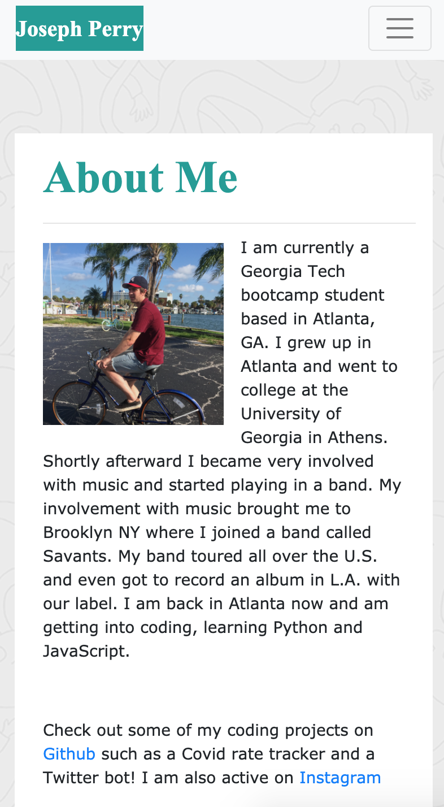
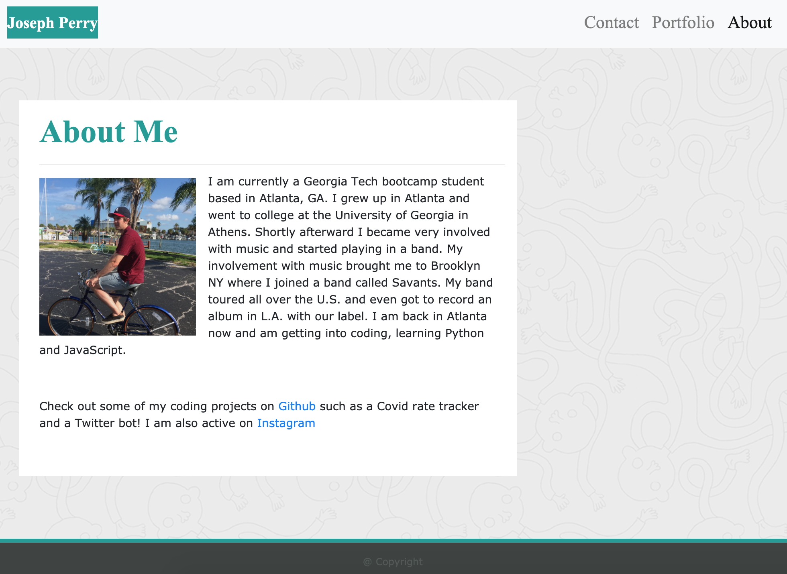

# hw-02-responsive-portfolio

I created an "About Me" website to match a given style with the use of HTML and CSS. The website has the three pages:
* about me
* portfolio
* contact

The most important feature of the website is that it is  optimized for mobile devices. CSS Bootstrap was used to create a grid system that enabled clean media breakpoints when resizing the window. The target viewpoints for media viewing are pixel widths of 400, 768, and 992. The difference in the about me page can be seen in the following screen widths of 400 and 992 pixels:

  
## Usage
The site can be accessed with the following link:

[About Me | Joseph](https://dgtlctzn.github.io/hw-02-responsive-portfolio/)

## Credits
Special thanks to CSS Bootstrap for the components and grid systems and for GA Tech Bootcamp for providing the necessary materials and information.

## License
MIT License

Copyright (c) 2020 Joseph Perry

Permission is hereby granted, free of charge, to any person obtaining a copy
of this software and associated documentation files (the "Software"), to deal
in the Software without restriction, including without limitation the rights
to use, copy, modify, merge, publish, distribute, sublicense, and/or sell
copies of the Software, and to permit persons to whom the Software is
furnished to do so, subject to the following conditions:

The above copyright notice and this permission notice shall be included in all
copies or substantial portions of the Software.

THE SOFTWARE IS PROVIDED "AS IS", WITHOUT WARRANTY OF ANY KIND, EXPRESS OR
IMPLIED, INCLUDING BUT NOT LIMITED TO THE WARRANTIES OF MERCHANTABILITY,
FITNESS FOR A PARTICULAR PURPOSE AND NONINFRINGEMENT. IN NO EVENT SHALL THE
AUTHORS OR COPYRIGHT HOLDERS BE LIABLE FOR ANY CLAIM, DAMAGES OR OTHER
LIABILITY, WHETHER IN AN ACTION OF CONTRACT, TORT OR OTHERWISE, ARISING FROM,
OUT OF OR IN CONNECTION WITH THE SOFTWARE OR THE USE OR OTHER DEALINGS IN THE
SOFTWARE. 